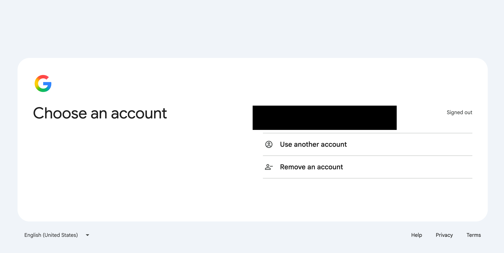
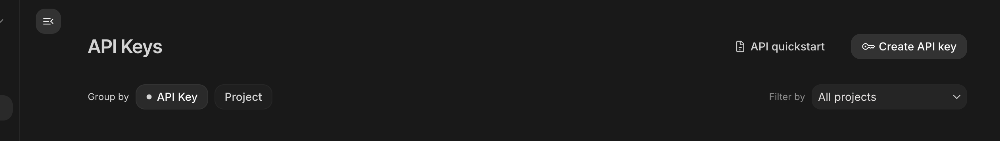
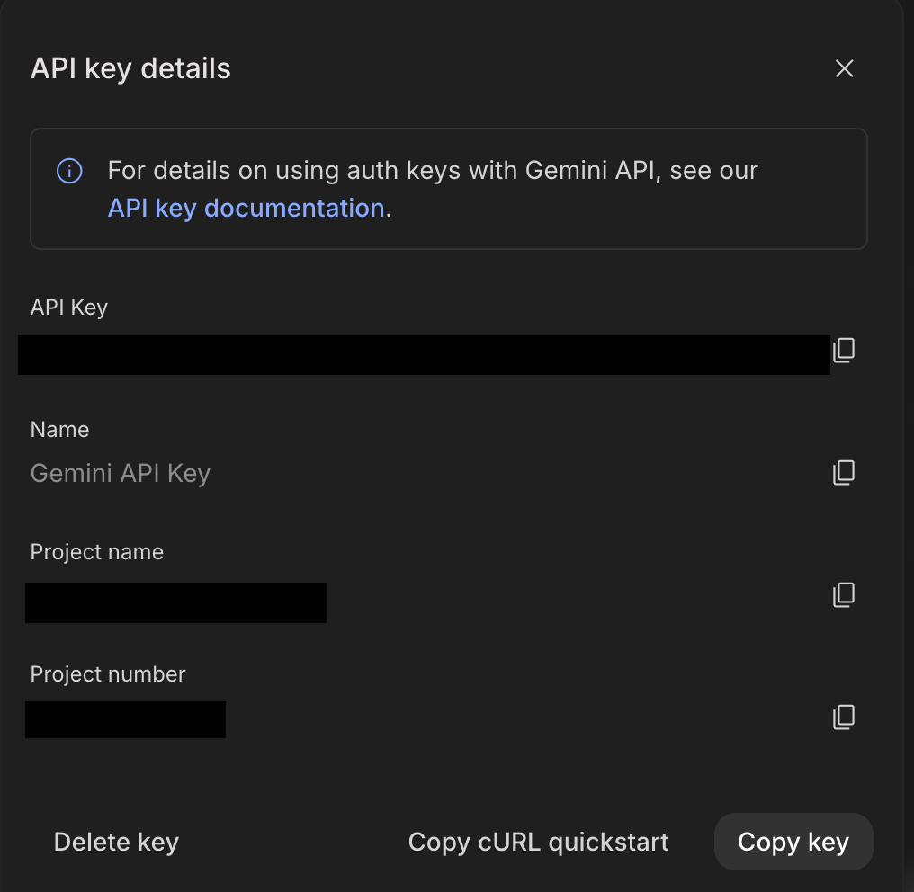

# Setup Guide

This guide gets you from an empty computer to asking your first question about your own
documents. It assumes no prior experience with a terminal — every command you need to type is
shown exactly as you should type it.

You will need about 10 minutes and one thing you have never had to create before: a free API key
from Google. That is the only account this product requires.

## 1. Install Node.js

kyzerdocs-lite runs on Node.js, version 22.5 or newer.

1. Open [nodejs.org](https://nodejs.org) in your browser.
2. Download the **LTS** version for your operating system and run the installer, accepting the
   defaults.
3. Confirm it installed by opening a terminal (on Windows, search for "Command Prompt" or
   "PowerShell"; on Mac, search for "Terminal") and typing:

   ```
   node -v
   ```

   You should see a version number starting with `v22` or higher. If you see "command not
   found," restart your terminal (or your computer) and try again — Node needs a fresh terminal
   session to be on your system's PATH.

## 2. Choose a folder for your knowledge base

Before you run anything, decide where your documents and your search index will live. Create a
folder and move into it:

```
mkdir my-knowledge-base
cd my-knowledge-base
```

This choice matters: **the knowledge base is stored in the folder you run the command from.**
Every time you start kyzerdocs-lite from this folder, you get the same documents and the same
chat history back. If you run the command from a different folder, you get a fresh, empty
knowledge base — there is no folder that is "the real one" behind the scenes. Pick one folder and
always start the app from inside it.

## 3. Get your Gemini API key

kyzerdocs-lite uses Google's Gemini API to read your documents and answer questions about them.
The key is free to obtain and Google's free tier is generous enough for normal use.

1. Go to [aistudio.google.com/apikey](https://aistudio.google.com/apikey) and sign in with any
   Google account.

   

2. Click **Create API key**. If asked to choose or create a project, accept the default.

   

3. Copy the key that appears. Keep this window open, or paste the key somewhere safe — you will
   paste it into kyzerdocs-lite in the next step, and you will not be shown it again after you
   close this page.

   

Treat this key like a password. Do not share it or commit it to a public repository.

## 4. Run the command

From inside the folder you chose in Step 2, run:

```
npx kyzerdocs-lite
```

The first time you run this, it downloads and starts the app, then asks you two questions right
in the terminal:

```
Paste your Gemini API key:
Choose an admin password:
```

Paste the key from Step 3 for the first question. For the second, type any password you want —
this is what you will use to sign in to your own copy of the app. There is no username and
nothing to remember beyond this one password.

Once you answer both prompts, the app validates your key and then prints a URL, for example:

```
kyzerdocs-lite is running at http://localhost:3000
```

If port 3000 is already used by something else on your computer, kyzerdocs-lite automatically
moves to the next free port and tells you which one it picked — you do not need to do anything
about this.

Open the printed address in your browser.

## 5. First login

The page that opens asks for the admin password you chose in Step 4. Enter it and you will land
on the document screen — empty, since you have not uploaded anything yet.

## 6. Upload your first document

On the document screen, drag a file onto the upload area (or click it to browse). kyzerdocs-lite
accepts **PDF, DOCX, TXT, and Markdown** files.

The document appears in the list with a status. Processing usually takes a few seconds to a
couple of minutes depending on the document's length — you can watch the status update, and you
do not need to keep the tab open in the foreground.

## 7. Ask your first question

Once at least one document shows a ready status, move to the chat screen and type a question
about it. The answer streams in, and every claim in it is followed by a clickable citation back
to the passage it came from — click one to see the exact source text.

If none of your uploaded documents actually answer the question you asked, kyzerdocs-lite tells
you so directly rather than guessing. That refusal is a deliberate, correct answer, not a
malfunction — it means nothing in your knowledge base supports a confident response.

## Troubleshooting: when something goes wrong

The document screen includes a health panel showing whether the database, your API key, and the
embedding model are all reachable — check it first if something seems broken.

Every error kyzerdocs-lite can show you carries a short code that looks like `KDL-CHAT-004` or
`KDL-CFG-001`. If you run into a problem, look up the code in
[docs/ERROR-CODES.md](./ERROR-CODES.md) — it explains what actually happened and what to do
next. If you need to reach out for support, quoting that code is the fastest way to get a useful
answer; it is far more specific than describing what you saw on screen.

**Known limitations of this version:** no OCR (a scanned PDF with no selectable text layer will
not extract), no PowerPoint (PPTX) support, and ingestion is text-only. A full list of
limitations ships in a later update to this documentation.

---

**Optional:** kyzerdocs-lite works fully on the Gemini key from Step 3 alone — nothing below this
line is required. If you want the chat model to run through
[OpenRouter](https://openrouter.ai/keys) instead of Gemini directly (for example, to try a
different model), set `OPENROUTER_API_KEY` in your `.env.local` file. This is optional and most
buyers never need it.
